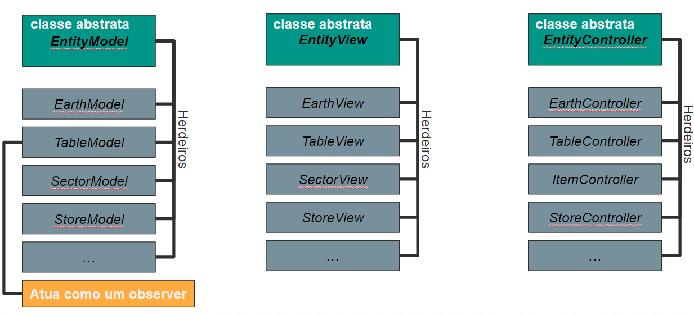
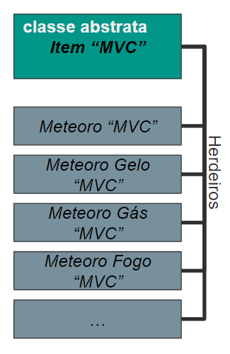

# Projeto MC322 - Acopalipse

# Introdução ao jogo
Você é um ser celestial escolhido pelo destino para atacar o planeta Terra e, eventualmente, causar a extinção dos dinossauros. Para isso, você deve fabricar meteoros e usá-los para realizar ataques à Terra.

Os meteoros são fabricados utilizando poeira estelar que vaga pelo espaço e quanto mais meteoros você possui, mais poeira estelar você atrai! Você também consegue fabricar diferentes tipos de meteoros, mas alguns não se dão bem com outros, então cuidado ao posicioná-los no tabuleiro.

# Equipe
* Guilherme Gelmi de Freitas Salvo - 232475
* Ícaro Chiabai - 247171

# Arquivo Executável do Jogo
[Versão final](/jars/versaoFinal.jar)
# Slides do Projeto

## Slides da Prévia
[Link da apresentação no Figma](https://www.figma.com/file/zpCDCda1nlvtic2MBH7p2o/MC322?node-id=0%3A1)
## Slides da Apresentação Final
[Link Google Slides](https://docs.google.com/presentation/d/1eoqNMRqX1qusBBDiKXzgcXkaNhuttGBCMEIitjlsO7k/edit?usp=sharing)

## Breve descrição
* É um jogo Idle
* O objetivo é causar a extinção dos dinossauros
* O jogador ataca a Terra com meteoros
* Os meteoros são feitos com poeira estelar, que é uma moeda de ganho passivo
* Existem diferentes tipos de meteoros, que interagem entre si de acordo com sua posição no tabuleiro
* Os meteoros podem ser melhorados até que você consiga destruir a terra

## Relatório de evolução
### Evolução do Design do projeto
O Design visual do projeto não passou por muitas mudanças. Esperávamos dar um retoque estético para a versão final, mas ocorreu que o tempo não fora suficiente para este objetivo ser cumprido. Entretanto, algumas alterações ocorreram, como pode-se perceber na foto abaixo.

Quanto ao Design geral, não houveram mudanças dignas de serem mencionadas exceto a falta do livro de conquistas, que era para ser incluido na versão final, mas não fora por má gestão do tempo, isto é, foi algo que exigiu tempo em excesso e não fomos capazes de atribuir essa funcionalidade em nosso projeto.

### Dificuldades enfrentadas
Enfrentamos algumas dificuldades com a biblioteca _LibGDX_ para entender categoricamente suas classes, métodos e relações entre objetos, com vazamentos de memória por conta de instanciamento indevido de objetos e, principalmente, com a gestão do projeto, em relação ao manejo do tempo e distribuição de tarefas entre os participantes.

### Melhorias e lições aprendidas
Quanto ao jogo em si, algumas melhorias, ajustes e adições surgiram em nossa mente, sendo algumas delas:
* Adição de upgrades globais (aumentar o tamanho do tabuleiro, incluir upgrades que afetam meteoros de um modo mais geral...)
* Mecânica de _New Game+_, isto é, quando o jogador conseguir destruir a Terra, o jogo "reinicia", porém, mais difícil e o jogador recebe alguns benefícios por isso, sem que o jogo acabe de uma vez.
* Adicionar funcionalidades para a Terra além de ser destruída, ou seja, que ela contra-ataque, se regenere com o tempo, tenha estações do ano definidas e que estas interajam com os meteoros.
* Adicionar novas interações entre os meteoros, como o meteoro de fogo dar dano contínuo na Terra, etc...
* Melhorar a estética do jogo reformulando os Sprites, adicionar efeitos sonoros, trilha sonora, efeitos visuais de ataque, compra, ambientação, etc...
* Adição de um livro de conquistas para aumentar a dinâmica, variedade e adicionar desafios ao jogo.

Mas ainda podemos relatar sobre as lições que aprendemos com os erros cometidos. Percebemos a dificuldade que um trabalho complexo em equipe exige e, portanto, estaremos mais preparados para futuras ocasiões que envolvam desenvolvimento em equipe, levando em consideração, também, o manejo de tempo. 

Aprendemos também a utilizar o _Design Thinking_ antes de começar a programar, isto é, arquitetar (ou esboçar uma arquitetura) para entender melhor quais funcionalidades queremos e quais classes serão responsáveis por tais funcionalidades, o pensamento prestimoso da Programação Orientada a Objetos. Essa etapa se desdobra em conhecer diferentes Padrões de Projetos, que vimos extensivamente na reta final do curso de MC322, e saber as situações ideais dos distintos Padrões de Projetos (não decorar, mas saber a existência de cada um e pesquisar rigorosamente para decidir se é ou não a melhor opção para uma determinada situação, e se pode ser levemente modificado para ocupar tal posição).

# Destaques de Orientação a Objetos

[comment]: <> (Uso de herança e encapsulapmento no MVC para reuso inteligente de código de forma coesa)

Atacamos o padrão _MVC_ de forma com que cada "tipo" de objeto possua 3 classes diferentes (uma model, uma view e outra controller), o motivo dessa decisão será explicada nos destaques de padrões de projeto. Assim, sempre que nos referirmos a "classes _MVC_" ou "objetos _MVC_" quer dizer que estamos nos referindo ao conjunto das 3 classes ou objetos, e esse comportamento se replica para o _model_, _view_ e _controller_ do "tipo" de objeto. Tomamos essa denominação para evitarmos que o texto fique prolixo.

Devido a biblioteca gráfica que utilizamos, cada objeto que renderizamos na tela requer alguns atributos e metodos comuns. Portanto, utilizamos a herança abstrata de forma extensiva para a classes _MVC_ dessas "entidades" que queremos renderizar na tela. Assim, podemos construir classes que respeitam o encapsulamento e deixam a responsabilidade das funcionalidades específicas para seus herdeiros. No final dessa seção há uma subseção com os diagramas que detalham as heranças.

~~~java
...
public abstract class EntityModel {
    private float x;
    private float y;
    private float height;
    private float width;
    private float rotation;
    private GameModel model;
	
    EntityModel(GameModel model, float x, float y, float height, float width, float rotation) {
        //Construtor genérico que será utilizado nos construtores específicos.
    }
    ...
    //Getters e setters dos atributos.
    ...
~~~
~~~java
public abstract class EntityView {

    private Sprite sprite;
    private GameView gameView;
	
    public EntityView(Acopalipse game, GameView gameView) {
        //Construtor genérico que será utilizado nos construtores específicos.
    }
    ...
    //Getters.
    ...
    //A função draw em geral é sobrescrita em cada entidade porém é definida aqui para caso onde precisemos desenhar objetos na tela de forma não polimorfica.
    public void draw(SpriteBatch batch) {
        sprite.draw(batch);
    }
	
    public abstract Sprite createSprite(Acopalipse game);
	
    public abstract void update(EntityModel model);
}
~~~

~~~java
public abstract class EntityController {

    GameController gameController;
	
    EntityController(GameController gameController){
	//Construtor genérico que será utilizado nos construtores específicos.
    }
    ...
    //Getters.
    ...
    abstract void touch(Vector3 touchPos);
}
~~~
[comment]: <> (Uso de polimorfismo para armazenamento de meteoros diferentes nos setores)

Como os meteoros de tipos diferentes ainda são, em geral, meteoros, é lógico que utilizemos herança para que cada classe de meteoro específica extenda uma classe abstrata genérica, que aqui chamaremos de _Item_ (o motivo da nomenclatura será explicada posteriormente). As classes _MVC_ do item são herdeiras abstratas das classes _MVC_ de entidade que sobrescrevem alguns metodos, implementam novos ou repassam a responsabilidade para seus herdeiros:

~~~java
public abstract class ItemModel extends EntityModel{

    private EntityModel entityModel;
    protected int dustPerSecond;
    protected int price;
    protected int power;
    private String itemName; 
    private Boolean buy;
	
    protected ItemModel(GameModel model, EntityModel entityModel, float x, float y, float height, float width, float rotation, int dps, int price, int power, String itemName) {
        super(model, x, y, height, width, rotation);
        //Resto do construtor específico.
    }
    ...
    //Getters e setters.
    ...
    //Metodos abstratos que deverão ser sobrescritos por seus herdeiros.
    public abstract Sprite createSprite();
    public abstract Sprite getSprite();
}
~~~

~~~java
public abstract class ItemView extends EntityView{

    private EntityView entityView;
    private BitmapFont font;
	
    public ItemView(Acopalipse game, EntityView entityView) {
        super(game, null);
        this.entityView = entityView;
        font = new BitmapFont();
        font.setColor(Color.BLACK);
    }
    ...
    //Getters.
    ...
    //Metodos draw().
    public void draw(...){
        //Como todos os meteoros são desenhados da mesma forma independente do tipo, cabe ao item implementar essa função
        //O item view consulta através do MVC do jogo o model do meteoro(classe que extende item model) e o guarda em um item model de forma polimorfica.
        ItemModel itemModel = entityView.getGameView().getGameModel().getStoreModel().getItemModelArray().get(i);
        ...
        //Resto das chamadas de desenho.
        ...
    }
    ...
}
~~~
Dessa forma podemos guardar, de forma polimórfica, todos os tipos de objetos _MVC_ dos meteóros específicos nos objetos _MVC_ do tabuleiro e da loja:

~~~java
public class SectorView extends EntityView {
	
    private TableView tableView;
    private Sprite selectedSprite;
    //Atributo do tipo "ItemView" que recebera um herdeiro de "ItemView".
    private ItemView meteorView;
    ...
    //Construtor específico, setters e métodos de criação das sprites e de desenho que utilizam da polimorfia.
    ...
}
~~~
~~~java
public class StoreView extends EntityView{
    //Lista de objetos "ItemView" onde serão guardados de forma polimorfica dos herdeiros de "ItemView".
    private Array<ItemView> itemViewArray;
    ...
    //Construtor específico, setters e métodos de criação das sprites e de desenho que utilizam da polimorfia.
    ...
}
~~~
Os comportamentos polimoficos se repetem de forma semelhante para as classes _TableModel_ e _StoreModel_

[comment]: <> (Uso de sobrecarga de método para a representação do mesmo conjunto de classe MVC em contextos diferentes)

Resolvemos chamar a classes _MVC_ abstratas dos meteoros de item para que possamos utilizar os mesmos objetos _MVC_ dentro da loja e do tabuleiro. Logo, quando um meteoro é comprado não há a instanciação de um novo objeto no setor e a destruição e instanciação de um novo objeto na loja, e sim o setor apenas recebe o ponteiro do objeto que está na loja, e ela instancia um novo de acordo com tipo do anterior:

~~~java
public class StoreController extends EntityController {

    public StoreController(GameController gameController) {
        super(gameController);
    }

    @Override
    public void touch(Vector3 touchPos) {
        StoreModel storeModel = getGameController().getGameModel().getStoreModel();
        if(touchPos.x >= storeModel.getX() && touchPos.y >= storeModel.getY() && touchPos.x <= storeModel.getX() + storeModel.getHeight() && touchPos.y <= storeModel.getY() + storeModel.getWidth()) {
            if(getGameController().getGameModel().getTableModel().getSelectedSector() != null) {
                int i = (int) Math.floor(touchPos.y/(storeModel.getWidth()/4))-1;
                int price = getGameController().getGameModel().getStoreModel().getItemModelArray().get(i).getPrice();
                if(getGameController().getGameModel().getDust() >= price) {
                    if(getGameController().getGameModel().getTableModel().getSelectedSectorModel().getMeteor() == null) {
                        getGameController().getGameModel().subDust(price);
                        //Depois de decidir se o meteoro pode ser comprado, o controller da loja avisa o controller do tabuleiro que um meteoro foi comprado e manda o ponteiro do meteoro que foi comprado.
                        getGameController().getTableContoller().buy(getGameController().getGameModel().getStoreModel().getItemModelArray().get(i));
                        //Além disso ele também altera o proprio model pedindo para que ele instancie um novo meteoro no lugar do antigo. 
                        //O metodo no model que é responsavel por deixar de utilizar o objeto antigo.
                        getGameController().getGameModel().getStoreModel().createItem(i, getGameController().getGameModel().getStoreModel().getItemModelArray().get(i));
                    }
                }
            }
        }
    }
}
~~~
O _controller_ do tabuleiro apenas faz o contato com o _model_ do tabuleiro e repassa o ponteiro recebido, e então o _model_ do tabuleiro efetua a rotina de compra:
~~~java
public class TableModel extends EntityModel{
    ...
    //Atributos e construtor.
    ...
    public void buy(ItemModel itemModel) {
        //Ao ser comprado o model do tabuleiro altera o model do item para que ele seja renderizado na posição correta. 
        int i = ((int)selectedSector.x) - 1;
        int j = ((int)selectedSector.y) - 1;
        itemModel.setPosition(64*(i+1), 64*(j+1));
        itemModel.buy();
        //Apenas atribui o ponteiro para setor correto.
        sectorModelMatrix.get(i).get(j).setMeteor(itemModel);
        //Alem disso, também executa as rotinas de interação caso os meteoros recebidos sejam de um tipo específico.
        if(itemModel instanceof FireMeteorModel) {
            fireCheck(i+1, j+1);
        } else if(itemModel instanceof IceMeteorModel) {
            iceCheck(i+1, j+1);
        }    
    }
    ...
    //Getters, setters e demais metodos.
    ...
}
~~~
Além disso, utilizamos uma sobrecarga de método para podermos desenhar o mesmo objeto de formas diferentes, visto que, para a lista a posição é apenas um numero e na matriz a posição é um "par ordenado":

~~~java
public abstract class ItemView extends EntityView{
    ...
    //Construtor e demais metodos.
    ...
    public void draw(SpriteBatch batch, int i) {    
        //Aqui consultamos o model do item e desenhamos o item como ele deve ser exibido na loja.
        ...
    }
	
    public void draw(SpriteBatch batch, int i, int j) {
        //Aqui também consultamos o model do item e desenhamos o item como ele deve ser exibido no tabuleiro.
        ...
    }
}
~~~

## Diagrama de Classes

Abaixo seguem diagramas de classes utilizados no projeto supramencionados e que já foram detalhados.

# Destaques de Pattern

O coração da arquitetura do nosso projeto é a utilização do padrão de projeto _Model-View-Controller_ de forma bem rigorosa onde teremos, para cada objeto (não no sentido de orientação a objetos) mostrado na tela, 3 classes - uma para cada papel do _pattern_ - que terão suas funções bem delimitadas e se relacionarão de forma bem específica.

Ao adotarmos esse formato, podemos explorar ao máximo os recursos da nossa biblioteca gráfica por exemplo gerando views especificas para Android e reusando código de forma inteligente. Esse compromisso com a arquitetura torna o processo de construção de novos objetos algo mais tedioso, visto que, é nessesário muitas vezes que criemos 3 classes diferentes que não se relacionam de forma direta. Porém, essa decisão nos retorna um código com alta coesão e um bom acoplamento.

Assim, existem classes _MVC_ do jogo, que são as principais instâncias. Elas são responsáveis por instanciar cada uma das classes _MVC_ respectivas das entidades e também intermediam as relações entre essas entidades. Vemos que cada Model-View-Controller do jogo é a raiz de sua arvore MVC, e suas folhas devem se relacionar exatamente da mesma forma para cada um delas. A unica comunicação entre os componentes de arvores diferentes se dá pela raiz, onde os Model-View-Controller do jogo tem ponteiros de seus complementares. Assim, cada entidade tem apenas uma referência do seu "pai" e de seus "filhos" mas mesmo assim pode acessar quase todas as classes do jogo.

Basicamente a _View Jogo_ é a nossa tela principal e ela é quem recebe os _inputs_ do usuário. Assim, ela os repassa para o _input processor_ (classe da biblioteca gráfica que lida com os _inputs_ evitando multiplos cliques e imprecisões) que conversa com o _Controller Jogo_. 

O _controller jogo_ distribui o _input_ para cada _controller de entidade_ que é responsavel por sua região na tela, assim como, por alterar o seu respectivo _model_ de acordo com o clique. Como a função _render_ é executada aproximadamente 60 vezes por segundo, por mais que ele se desenhe a cada chamada, seria ineficiente atualizarmos o _view_ inteiro pois ele não é atualizado nessa velocidade. Então, o _controller_ também tem a função de avisar ao _view_ para que ele se atualize.

O _view jogo_ então é avisado pelo _controller_ e não só se atualiza como pede para que todas as suas instâncias de _view entidade_ também se atualizem. A atualizção é uma consulta ao seu respectivo _model_ perguntando sobre seu novo estado de relacionamento das classes, então, de acordo com ele, o _view_ replica esse mesmo relacionamento.

Também durante a atividade a respeito de padrões de projeto planejamos utilizar os _patterns_ _Observer_ e _Factory_, porém acabamos não os implementando de forma completa por falta de organização.

O sistema de atualização da quantidade de poeira atraída por segundo funciona de forma análoga a um _observer_. Cada _SectorModel_ está "observando" a classe _TableModel_ (a matriz de observadores contém cada um dos _SectorModel_). Assim, a cada segundo, o tabuleiro percorre a matriz perguntando pra cada setor qual é a poeira por segundo que ele atrai.

~~~java
public int getDustPerSecond() {
  int dps = 0;
  for(int i = 0; i < 4; i++){
    for(int j = 0; j < 4; j++){
      ItemModel sectorModelItem = sectorModelMatrix.get(i).get(j).getMeteor();
      if(sectorModelItem != null){
        dps += sectorModelItem.getDustPerSecond();
      }
    }
  }
}
~~~

O pattern _Factory_ seria explorado para instanciar os diversos tipos de meteoros e, além disso, fazer com que cada um deles tivesse um impacto diferente na Terra no momento de sua criação (por exemplo: dano contínuo).

## Diagrama do Pattern

 
# Diagramas

## Diagrama Geral da Arquitetura do Jogo

Inicialmente pensamos em utilizar o padrão de projeto _MVC_ de uma forma mais elegante, onde exista um _MVC_ Geral que interage com vários _MVCs_ de Entidades do jogo.

Portanto, temos um _Model_ para o jogo que interage com o _Model_ das entidades e essa estratégia se repete para o _View_ e _Controller_, como podemos notar no diagrama abaixo.

Logo, o diagrama geral da arquitetura do jogo seria algo do tipo abaixo, omitimos algumas entidades porque seria mais atordoante do que esclarecedor.

Também devemos lembrar que algumas entidades possuem outras entidades, como o _Table_, que possui _Sections_ que, por sua vez, podem ou não possuir itens, e toda essa cadeia de interações vira algo fácil de ser controlado e integrado quando utilizamos essa estratégia de a interação entre um _MVC_ geral e vários _MVCs_ de entidades.

