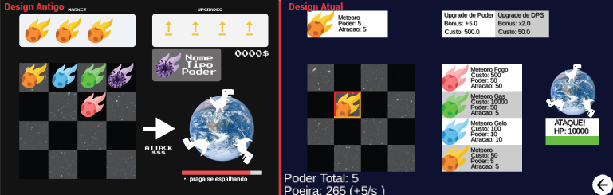
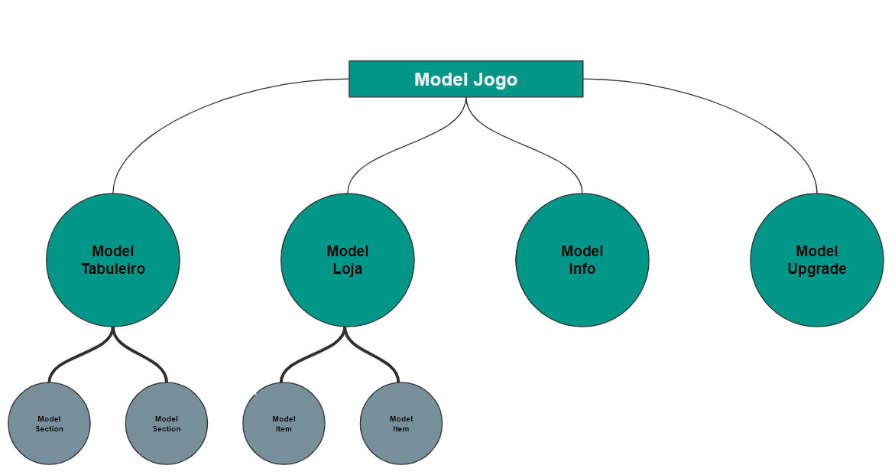

# Projeto MC322 - Acopalipse
- É um jogo Idle
- O objetivo é causar a extinção dos dinossauros
- O jogador ataca a Terra com meteoros
- Os meteoros são feitos com poeira estelar, que é uma moeda de ganho passivo
- Existem diferentes tipos de meteoros, que interagem entre si de acordo com sua posição no tabuleiro
- Os meteoros podem ser melhorados até que você consiga destruir a terra

# Equipe
* Guilherme Gelmi de Freitas Salvo - 232475
* Ícaro Chiabai - 247171

# Arquivo Executável do Jogo
[Versão final](/jars/versaoFinal.jar)
# Slides do Projeto

## Slides da Prévia
[Link da apresentação no Figma](https://www.figma.com/file/zpCDCda1nlvtic2MBH7p2o/MC322?node-id=0%3A1)
## Slides da Apresentação Final
[Link Google Slides](https://docs.google.com/presentation/d/1eoqNMRqX1qusBBDiKXzgcXkaNhuttGBCMEIitjlsO7k/edit?usp=sharing)

## Relatório de evolução
### Evolução do Design do projeto
O Design visual do projeto não passou por muitas mudanças. Esperávamos dar um retoque estético para a versão final, mas ocorreu que o tempo não fora suficiente para este objetivo ser cumprido. Entretanto, algumas alterações ocorreram, como pode-se perceber na foto abaixo.

Quanto ao Design geral, não houveram mudanças dignas de serem mencionadas exceto a falta do livro de conquistas, que era para ser incluido na versão final, mas não fora por má gestão do tempo, isto é, foi algo que exigiu tempo em excesso e não fomos capazes de atribuir essa funcionalidade em nosso projeto.

### Dificuldades enfrentadas
Enfrentamos algumas dificuldades com a biblioteca LibGDX para entender categoricamente suas classes, métodos e relações entre objetos, com vazamentos de memória por conta de instanciamento indevido de objetos e, principalmente, com a gestão do projeto, em relação ao manejo do tempo e distribuição de tarefas entre os participantes.

### Melhorias e lições aprendidas
Quanto ao jogo em si, algumas melhorias, ajustes e adições surgiram em nossa mente, sendo algumas delas:
* Adição de upgrades globais (aumentar o tamanho do tabuleiro, incluir upgrades que afetam meteoros de um modo mais geral...)
* Mecânica de New Game+, isto é, quando o jogador conseguir destruir a Terra, o jogo "reinicia", porém, mais difícil e o jogador recebe alguns benefícios por isso, sem que o jogo acabe de uma vez.
* Adicionar funcionalidades para a Terra além de ser destruída, ou seja, que ela contra-ataque, se regenere com o tempo, tenha estações do ano definidas e que estas interajam com os meteoros.
* Adicionar novas interações entre os meteoros, como o meteoro de fogo dar dano contínuo na Terra, etc...
* Melhorar a estética do jogo reformulando os Sprites, adicionar efeitos sonoros, trilha sonora, efeitos visuais de ataque, compra, ambientação, etc...

# Destaques de Código
~~~java
public int getDustPerSecond() { // Calculo
  int dps = 0;
  for(int i = 0; i < 4; i++){
    for(int j = 0; j < 4; j++){
      ItemModel sectorModelItem = sectorModelMatrix.get(i).get(j).getMeteor();
      if(sectorModelItem != null){
        dps += sectorModelItem.getDustPerSecond();
      }
    }
  }
}
~~~

# Diagramas

## Diagrama Geral da Arquitetura do Jogo

Inicialmente pensamos em utilizar o padrão de projeto MVC de uma forma mais elegante, onde exista um MVC Geral que interage com vários MVCs de Entidades do jogo.

Portanto, temos um Model para o jogo que interage com o Model das entidades e essa estratégia se repete para o View e Controller, como podemos notar no diagrama abaixo.

Logo, o diagrama geral da arquitetura do jogo seria algo do tipo abaixo, omitimos algumas entidades porque seria mais atordoante do que esclarecedor.

Também devemos lembrar que algumas entidades possuem outras entidades, como o tabuleiro, que possui seções que, por sua vez, podem ou não possuir itens.

